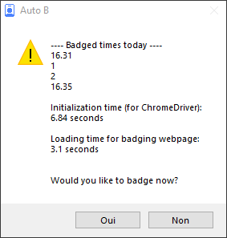

<p align="center">
  
</p>

# autoBadging

User interface to help with badging on *Horoquartz - eTemptation*

This is a easy-to-use user interface to simply badge on Horoquartz from your Windows desktop, without ever having to open the website! It could be added to your Windows startup process so it opens automatically when you log in on your PC and you don't even have to think about it!

## Features / To-do list
- [x] Easy badging without ever needing to open a browser by yourself
- [x] Creates the shortcuts on your Windows desktop and taskbar
- [x] Given permission, adds itself to Windows' startup process to badge when you log in to your PC
- [ ] Easy installation (improve first time setup with password generation etc.)
- [ ] Support for Linux (only tested on Windows)

## Screenshot



## Installation

Please make sure you have the following prerequisites:

- [Git](https://git-scm.com/downloads)
- [Python 3](https://www.python.org/downloads/) (tested with 3.10.11)
- [Google Chrome](https://www.google.com/chrome/) (tested with 119.0.6045.160)

### Downloading the source code

Clone the repository:

```shell
git clone https://github.com/AngeIo/autobadging
```

To update the source code to the latest commit, run the following command inside the `autobadging` directory:

```shell
git pull
```

## Usage

### Dependencies
Download all the required packages for the script by running the following command in your terminal:

```shell
pip install -r requirements.txt
```

### Encryption of your password
Utilize the dedicated script in the `utils` directory to generate an encrypted version of your *Horoquartz* password. Save the result for later use. Run the following command:

```shell
python utils/pwgen.py "MyStrongPassword"
```

Or type the same command without the password at the end to type it hidden:

```shell
python utils/pwgen.py
```

### Variables configuration
You have to:

- Rename `variables.py.template` to `variables.py`.
- Copy and paste your encrypted password in the `hq_password` variable.
- Modify all other variables in `variables.py` to match your environment.

### Compile & install
Run the compiler and installation scripts using the following command:

```shell
python utils/make.py
```

### Run the Script
To execute the script, click on the `autob` shortcut in your taskbar or on your desktop!

## License
The source code for "autobadging" is using a *???* license (we haven't decided yet).

## Authors
* 0x546F6D (creator of pttb)
* A lot of open source contributors
* Angelo

